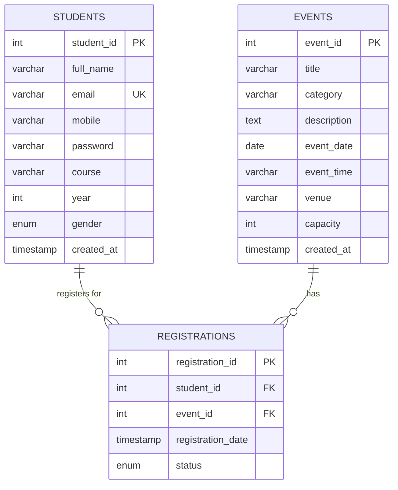

# Practical 8: MySQL Schema Design, ER Model, PDO Connectivity, and Prepared Statements

## 1. Problem Definition
Design the relational database for **StudentHub** with `students`, `events`, and `registrations`. Connect PHP to MySQL securely using PDO and parameterized prepared statements.

---

## 2. Entity-Relationship (ER) Model

---

## 3. Schema Normalization (3NF)

1. **First Normal Form (1NF)**:
   - Each column contains atomic (indivisible) values.
   - Each table has a unique Primary Key (`student_id`, `event_id`, `registration_id`).
   - No repeating groups.

2. **Second Normal Form (2NF)**:
   - Meets all 1NF rules.
   - No partial dependency: all non-key attributes depend on the entire primary key.

3. **Third Normal Form (3NF)**:
   - Meets all 2NF rules.
   - No transitive dependencies: non-key attributes depend only on the primary key, not on other non-key attributes.

---

## 4. Key Questions & Interpretation

| Question | Answer & Implementation |
|---|---|
| **1. Is the schema normalized properly?** | Yes, normalized to 3NF with independent entities (`students`, `events`) and a junction entity (`registrations`). |
| **2. Are Primary & Foreign keys correctly defined?** | Primary Keys: `student_id`, `event_id`, `registration_id`. Foreign Keys: `student_id` & `event_id` in `registrations` with `ON DELETE CASCADE`. |
| **3. Is the database connection handled securely?** | Yes, using PHP **PDO** (`new PDO(...)`) with `ERRMODE_EXCEPTION`, `EMULATE_PREPARES => false`, and `try-catch` exception handling. |
| **4. Are SQL injection vulnerabilities prevented?** | Yes, all database queries use **Parameterized Prepared Statements** (`$stmt->prepare()` and `$stmt->execute()`). |

---

## 5. How to Setup in phpMyAdmin

1. Open **XAMPP Control Panel** and start **Apache** & **MySQL**.
2. Open your browser and go to `http://localhost/phpmyadmin/`.
3. Click on the **Import** tab.
4. Choose the file [`schema.sql`](file:///c:/Users/Admin/OneDrive/Desktop/LAB%20WORK/student%20po/PRACTICAL-8/schema.sql) and click **Import**.
5. The `studenthub` database with `students`, `events`, and `registrations` tables will be created.
